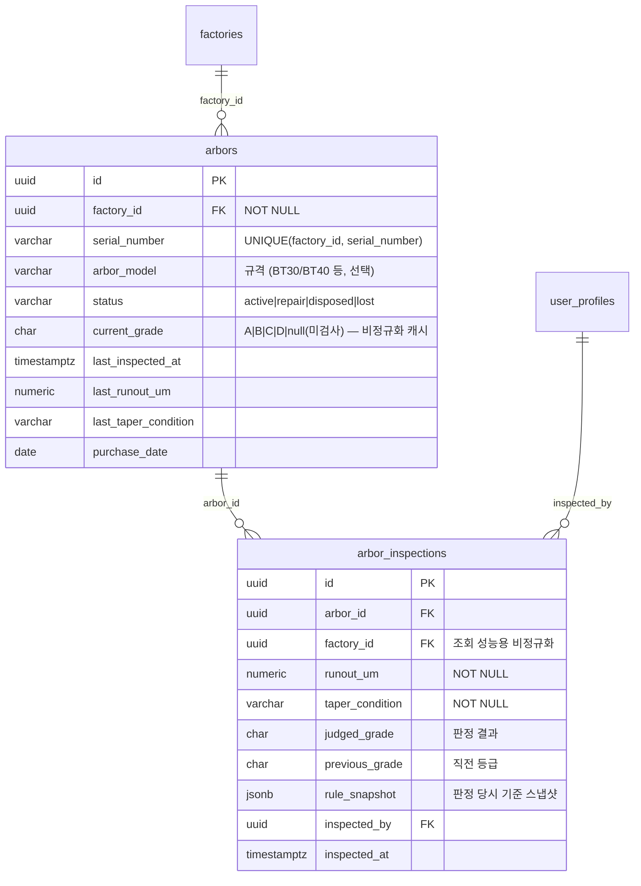

# Arbor 등급 관리 기능 — 문제 분석 및 기획서 (PRD)

> - 작성일: 2026-07-04 · 상태: **Draft v1.1 (구현 계획 수립 — §11 기본값 잠정 채택)**
> - 구현 계획: [ARBOR_GRADING_IMPLEMENTATION_PLAN.md](./ARBOR_GRADING_IMPLEMENTATION_PLAN.md)
> - 근거 자료: Supabase 프로덕션 실측 데이터(2026-07-04 조회), 코드베이스 정밀 탐색,
>   [2026-06-29 장애 사후분석](./incident-2026-06-29-db-exhaustion-postmortem.md), 버그 감사(`.omc/bug-audit-findings.md`)
> - 요청 범위: ① Arbor 30,000개(1공장 20,000 / 2공장 10,000) 외관(Taper)·Runout 기반 A/B/C/D 등급 관리
>   ② 현재 Supabase 운영 문제 분석 ③ 기획서 작성

---

## 1. 요약 (TL;DR)

| 질문 | 결론 |
|---|---|
| 3만 개 Arbor를 현재 Supabase가 감당 가능한가? | **가능.** 데이터 증가량은 첫해 약 30~120MB(검사 주기에 따라 다름, 현재 DB 116MB). 컴퓨트 업그레이드 불필요 |
| 그럼 문제가 없는가? | **아니오.** 데이터 크기가 아니라 **접근 패턴**이 문제. 현재 코드 관행 3가지(전체 행 클라이언트 fetch, 신규 테이블 Realtime 자동 등록, Auth 연결 캡 10 미해결)가 3만 행 규모에서 그대로 재현되면 **6/29 장애 패턴이 재발**할 수 있음 |
| 다공장(1공장/2공장) 지원은? | **이미 구축돼 있음.** `factories`(ALT/ALV 2개 운영 중), `user_factory_access`(80명 전원 매핑), `factory_id` 컬럼 패턴, 공장 접근 RPC 3종이 라이브 상태. Arbor는 이 패턴을 그대로 상속하면 됨 |
| 권장 진행 방식 | **Phase 0(안정화 선행 조치) → Phase 1(마스터/대량등록) → Phase 2(검사/판정) → Phase 3(통계/알림)** 4단계. §9 참조 |

---

## 2. 배경 및 목표

### 2.1 Arbor 등급 관리가 필요한 이유

Arbor(공구 홀더)는 CNC 스핀들과 엔드밀을 연결하는 정밀 부품이다. Taper 접촉면 마모·손상과
Runout(회전 흔들림) 증가는 가공 정밀도 저하, 표면 조도 불량, 엔드밀 조기 파손으로 직결된다.
현재 시스템은 엔드밀(소모품, 타입별 수량 관리)만 다루며 Arbor는 **개별 단위 이력 추적**이 필요한
새로운 관리 대상이다.

### 2.2 목표

1. 총 30,000개 Arbor의 **개별 식별**(시리얼) 및 마스터 등록 (1공장 20,000 / 2공장 10,000)
2. 검사 결과(Taper 외관 + Runout 값) 입력 시 **A/B/C/D 등급 자동 판정** 및 이력 보존
3. 공장별·등급별 **현황 통계** (D급 비율, 검사 지연 수량 등)
4. D급 Arbor의 폐기/수리 프로세스 연결
5. 현장 태블릿에서 **건당 10초 이내** 검사 입력 (USB 바코드 스캐너 연속 스캔)

### 2.3 성공 기준 (제안)

- 초기 30,000건 Excel 등록을 오류 리포트와 함께 완료 (실패 행 재업로드 가능)
- 검사 입력 → 등급 반영까지 1초 이내, 목록/통계 화면 응답 1초 이내
- 등급 기준 변경 시에도 과거 검사의 판정 근거가 보존됨 (감사 가능성)

---

## 3. 현재 시스템 분석 (실측)

### 3.1 인프라 현황 (2026-07-04 실측)

| 항목 | 값 | 비고 |
|---|---|---|
| Supabase 프로젝트 | CNC ENDMILL MANAGEMENT (`ap-southeast-1`, PG 17.6) | ACTIVE_HEALTHY |
| DB 전체 크기 | **116 MB** | |
| 컴퓨트 | Small 수준 추정 (`max_connections` 90, `shared_buffers` 512MB) | 6/29 장애 시 업그레이드 완료 |
| 활성 연결 | 37 / 90 | 평시 여유 있음 |
| 사용자 | auth.users **80명** | `user_factory_access` 80건 (전원 공장 매핑 완료) |
| 공장 | **ALT** (ALMUS TECH), **ALV** (ALMUS VINA) 2개 운영 중 | `inventory`에 2개 공장 데이터 실존 |

### 3.2 데이터 현황 (주요 테이블)

| 테이블 | 실제 행 수 | 크기 | 특이사항 |
|---|---:|---:|---|
| tool_changes | 8,873 | 40 MB (힙 28 + 인덱스 12) | 행당 ~4.5KB로 비대. dead tuple 1,530 |
| tool_positions | 22,213 | 5.9 MB | **이미 2만 행 이상을 무리 없이 운영 중인 선례** |
| equipment | 1,150 | 0.5 MB | 통계 캐시(n_live_tup)는 0으로 표시 — ANALYZE 필요 신호 |
| inventory / transactions | 481 / 782 | 0.3 / 7 MB | |
| auth.sessions | **11,276** | 3.7 MB | 사용자 80명 대비 과다 누적 (§4.2-5) |
| auth.audit_log_entries | 4,089 | 25 MB | |
| auth.refresh_tokens | 1,218 | 14 MB | 6/29 장애 잔재 bloat 추정 |

### 3.3 재사용 가능한 기존 자산

| 자산 | 위치 | Arbor 기능에서의 활용 |
|---|---|---|
| 다공장 인프라 | `supabase/migrations/20260127000000_add_multi_factory.sql`, `lib/hooks/useFactory.ts` | `factory_id` FK + `user_has_factory_access()` RPC + 헤더 공장 선택기 그대로 상속 |
| Excel 대량 업로드 | `app/api/equipment/bulk-upload/route.ts`, `lib/utils/equipmentExcelTemplate.ts` | 요청당 1,000행 제한, 배치 처리, `maxDuration 300s`, 성공/실패/중복 리포트 패턴 재사용 |
| 설정 시스템 | `system_settings` + `settings_history` + `upsert_setting()` RPC, `lib/types/settings.ts` | 등급 기준(Runout 컷오프, Taper 분류)을 관리자 설정으로 저장 |
| 권한 시스템 | `lib/auth/permissions.ts` | `AVAILABLE_RESOURCES`에 리소스 추가 3곳 수정으로 완결 |
| 폐기 관리 | `endmill_disposals` 테이블 + 화면 | D급 Arbor 폐기 프로세스의 참조 모델 |
| QR/바코드 | 재고 입고 화면의 USB 스캐너(키보드 에뮬레이션) 처리 패턴 | 검사 모드 연속 스캔 입력에 동일 방식 적용 |
| 낙관적 동시성 제어 | `app/api/inventory/outbound/route.ts`의 `.gte()` 가드 + 실패 롤백 | 검사 기록+등급 갱신 트랜잭션 설계 참조 |

---

## 4. Supabase 운영 문제점 분석

### 4.1 2026-06-29 장애 요약과 잔존 위험

```
컴퓨트 리소스 소진(Disk IO/CPU/연결)
  → Postgres 연결 타임아웃
  → Auth(GoTrue)가 연결을 못 얻음 → 로그인 401
  → 클라이언트 재시도 ×3 + Realtime 자동 재연결 → 부하 증폭 (death spiral)
```

코드 패치(커밋 `5b33989`)로 재시도 1회 축소, 지수 백오프+지터, Realtime 킬스위치
(`NEXT_PUBLIC_REALTIME_ENABLED`), 채널 정리(`removeChannel`)는 완료됐다.
그러나 **Auth 서버의 DB 연결 캡 10개(절대값 고정)는 미해결**이다. 컴퓨트를 올려
`max_connections`가 90이 되어도 Auth는 10개만 쓴다. **Arbor 도입으로 사용자·트래픽이 늘면
교대 시작 시간대 동시 로그인 폭주 → 로그인만 콕 집어 실패하는 6/29 패턴 재발 위험이 커진다.**

### 4.2 실측으로 확인된 현재 문제 (우선순위순)

| # | 심각도 | 문제 | 실측 근거 | Arbor 기능과의 관계 |
|---|---|---|---|---|
| 1 | 🔴 | **핵심 테이블 18개 RLS 비활성** — anon 키만 있으면 equipment, inventory, tool_changes 등 전체 읽기/쓰기 가능 | Security Advisor ERROR 18건 | 신규 Arbor 테이블은 **처음부터 RLS 적용**으로 이 부채를 늘리지 않아야 함. 기존 18개는 별도 트랙(§9 Phase 0 참고) |
| 2 | 🔴 | **`execute_safe_query(query text)` SECURITY DEFINER 함수가 anon 롤로 호출 가능** — 인증 없이 임의 조회 통로 | Security Advisor WARN | Arbor와 무관하지만 즉시 조치 권장: anon/authenticated의 EXECUTE 권한 REVOKE 검토 |
| 3 | 🔴 | **목록 페이지가 서버 페이지네이션 없이 전체 행을 클라이언트로 fetch** — 설비(1,150행)·재고 목록 모두 클라이언트에서 slice 페이지네이션. 목록 데이터 훅에서 `.range()`/`.limit()` 사용처 없음 | `app/dashboard/equipment/page.tsx`, `app/dashboard/inventory/page.tsx` | **30,000행에는 치명적** (요청당 수 MB egress, 브라우저 메모리, Disk IO). Arbor 목록은 서버 페이지네이션 필수 (§8.1) |
| 4 | 🟡 | **Realtime publication에 public 테이블 23개 등록** — 구독 여부와 무관하게 모든 쓰기가 WAL→Realtime 처리 경유. 6/29 장애 시 Realtime publication 조회 4,356회가 상위 IO 쿼리였음 | `pg_publication_tables` 실측 23건 | Arbor 테이블은 **publication에 추가 금지**. 검사 캠페인 중 대량 insert가 Realtime 부하로 전이되는 것 차단 |
| 5 | 🟡 | **auth.sessions 11,276행 누적** (80명 대비 140배), refresh_tokens 14MB — 6/29 당시 세션 검증 쿼리(~20,000회)가 상위 IO였음 | 실측 | 사용자 증가 전 세션 정책(time-box/inactivity timeout) 설정 및 정리 필요 |
| 6 | 🟡 | **FK 커버링 인덱스 24개 부재** — 6/29 정리 때 미사용 인덱스 53개 드롭의 부작용 (postmortem이 이미 선별 재추가 권고) | Performance Advisor INFO 24건 | 성장 테이블(tool_changes, inventory_transactions)의 JOIN 컬럼만 선별 재추가. Arbor 신규 인덱스도 같은 원칙(감사용 `*_by` 컬럼 인덱스 제외)으로 최소 설계 |
| 7 | 🟡 | **다공장 필터 fail-open** — `factoryId` 미지정 시 전 공장 데이터 반환(`lib/utils/factoryFilter.ts`), 설비 상세의 공장 필터 누락, `(factory_id, equipment_number)` 복합 UNIQUE 부재 | 버그 감사 #1, #2 (검증 완료 상태) | Arbor API는 **fail-closed**(factoryId 필수, 누락 시 400)로 설계하고, `(factory_id, serial_number)` 복합 UNIQUE를 처음부터 넣어 동일 실수 차단 |
| 8 | 🟡 | **settings 변경 API에 권한 체크 부재 + service-role로 RLS 우회** | 버그 감사 #3 | Arbor 등급 기준도 설정에 저장되므로, 등급 기준 API는 `hasPermission()` 검증을 반드시 포함 |
| 9 | 🟢 | RLS initplan 비효율 16건, 중복 permissive 정책 13건, tool_changes 비대(행당 4.5KB) | Advisor WARN | Arbor RLS 정책은 `(select auth.uid())` 래핑 + 역할별 단일 정책으로 작성해 같은 lint를 만들지 않음 |

### 4.3 Arbor 30,000개 추가 시 용량·부하 영향 (정량 분석)

**저장 용량** — 문제 없음:

| 항목 | 산정 | 예상 크기 |
|---|---|---|
| `arbors` 30,000행 | ~250B/행 + 인덱스 4개 | **약 20MB** (1회성) |
| `arbor_inspections` 연간 | 연 1회 전수(30K행) / 분기(120K행) / 월(360K행) | **연 10 / 35 / 100 MB** |
| 5년 누적 최대치(월 전수 가정) | 180만 행 | ~500MB → 이 시점엔 아카이빙 필요 (§10) |

현재 116MB + 첫해 최대 120MB 수준. 참고로 `tool_positions`는 이미 22,213행을 무리 없이
운영 중이다. **행 수 자체는 검증된 규모다.**

**쓰기 부하** — 문제 없음:

- 검사 캠페인 시나리오: 검사원 10명 × 건당 10초 = 시간당 3,600건 ≈ **초당 1건 insert + 1건 update**.
  6/29 장애의 쓰기 IO(세션 churn + Realtime)와 비교하면 무시할 수준
- 초기 등록: 30,000행 × ~200B ≈ 총 6MB. 500행 단위 배열 insert × 60요청이면 수 분 내 완료

**읽기 부하** — 조건부:

- 등급 통계: `(factory_id, current_grade)` 인덱스 위 GROUP BY → ms 단위. 단 **집계는 SQL(RPC)로
  수행**해야 하며, 현 대시보드처럼 원본 행을 받아 JS로 집계하는 방식을 30K행에 쓰면 안 됨
- 목록: 서버 페이지네이션(50행/페이지) 시 요청당 ~15KB. 전체-fetch 시 요청당 ~7MB × 접속자 수 → 금지

**결론: 병목은 데이터가 아니라 접근 패턴이다.** 아래 5원칙을 지키면 현 컴퓨트로 충분하다.

### 4.4 Arbor 기능 설계 5원칙 (6/29 재발 방지)

1. **Realtime 등록 금지** — `arbors`/`arbor_inspections`를 publication에 추가하지 않는다.
   갱신 반영은 React Query invalidation으로 충분 (검사 입력자는 본인 화면, 관리자는 staleTime 1분)
2. **서버 페이지네이션 필수** — `.range()` 기반, 전체-fetch API를 만들지 않는다 (Excel 내보내기도 청크)
3. **접근 통제는 API 레이어에서** — RLS는 사용자 결정(2026-07-04)에 따라 기존 18개 테이블과 함께
   **차후 별도 트랙에서 일괄 적용**한다. 그 전까지 신규 Arbor API는 `hasPermission()` 권한 검증 +
   factoryId 필수 검증을 주 통제로 삼고, §6.2의 RLS 정책 초안은 적용 시점에 사용한다
4. **fail-closed 공장 필터** — API에서 `factoryId` 필수 검증(누락 시 400), DB에 복합 UNIQUE
5. **집계는 SQL로** — 통계는 RPC 함수(GROUP BY)로 계산해 행이 아닌 결과만 전송한다

---

## 5. 요구사항 정의

### 5.1 기능 요구사항

| ID | 요구사항 | Phase |
|---|---|---|
| FR-1 | Arbor 마스터 등록/수정/조회 — 시리얼, 공장, 규격(선택), 상태(active/repair/disposed/lost) | 1 |
| FR-2 | Excel 대량 등록 — **초기 데이터 구축의 최우선 경로** (템플릿 다운로드 → 업로드 → 성공/실패/중복 리포트, 초기 등급·Runout·Taper 선택 컬럼으로 기존 조사 데이터 이관 지원) | 1 |
| FR-3 | Arbor 목록 — 서버 페이지네이션 + 필터(등급/상태/검사 경과일) + 시리얼 검색, 공장은 헤더 선택기 연동 | 1 |
| FR-4 | Arbor 상세 — 현재 등급, 검사 이력 타임라인 | 1 |
| FR-5 | 검사 입력 — 스캔/검색으로 Arbor 특정 → Runout(µm) 입력 + Taper 외관 선택 → **등급 자동 판정** 표시 → 저장 | 2 |
| FR-6 | 연속 검사 모드 — USB 스캐너 연속 스캔, 저장 후 자동으로 다음 입력 대기 (건당 10초 목표) | 2 |
| FR-7 | 등급 기준 관리(관리자) — Runout 컷오프, Taper 분류→등급 상한 매핑, 검사 주기(일) 설정 | 2 |
| FR-8 | 등급 판정 근거 보존 — 검사 행에 판정 당시 기준 스냅샷 저장 | 2 |
| FR-9 | 통계 — 공장별 등급 분포, D급 수량, 검사 지연(주기 초과) 수량 카드 + 대시보드 요약 | 3 |
| FR-10 | 상태 전환 프로세스 — D급 → 폐기/수리 처리, 수리 후 재검사 시 등급 복귀 | 3 |
| FR-11 | Excel 내보내기 (필터 결과 기준, 청크 방식) | 3 |
| FR-12 | 알림 — 검사 지연·D급 현황은 Phase 3 통계 카드로 1차 제공, notifications 푸시 연동은 후속 트랙 | 후속 |

### 5.2 비기능 요구사항

- **성능**: 목록/통계 응답 1초 이내, 검사 저장 1초 이내, 초기 3만 행 등록 10분 이내
- **보안**: 신규 테이블 RLS 필수, API `hasPermission()` + factoryId fail-closed, 등급 기준 변경은 admin 이상
- **i18n**: 한국어/베트남어 동시 제공 (`lib/i18n.ts`에 `arbor` 네임스페이스, ko/vi 병기)
- **모바일**: 태블릿 우선 검사 UI(`min-h-touch` 44px), USB 스캐너 키보드 에뮬레이션 지원
- **감사**: 등급 변경 이력은 검사 행으로 자연 보존, 마스터 변경은 activity_logs 기록

---

## 6. 데이터 모델 설계

### 6.1 ERD



### 6.2 DDL 초안

```sql
-- 마이그레이션: add_arbor_grading
create table public.arbors (
  id uuid primary key default gen_random_uuid(),
  factory_id uuid not null references public.factories(id),
  serial_number varchar(30) not null,
  arbor_model varchar(50),
  status varchar(20) not null default 'active'
    check (status in ('active','repair','disposed','lost')),
  current_grade char(1) check (current_grade in ('A','B','C','D')),
  last_inspected_at timestamptz,
  last_runout_um numeric(6,2),
  last_taper_condition varchar(20),
  purchase_date date,
  notes text,
  created_at timestamptz not null default now(),
  updated_at timestamptz not null default now(),
  constraint uq_arbors_factory_serial unique (factory_id, serial_number)
);
-- 인덱스 최소주의(6/29 교훈: 쓰기 IO 절감). UNIQUE가 시리얼 조회 커버
create index idx_arbors_factory_grade  on public.arbors (factory_id, current_grade);
create index idx_arbors_factory_status on public.arbors (factory_id, status);
create index idx_arbors_last_inspected on public.arbors (factory_id, last_inspected_at);

create table public.arbor_inspections (
  id uuid primary key default gen_random_uuid(),
  arbor_id uuid not null references public.arbors(id),
  factory_id uuid not null references public.factories(id),
  runout_um numeric(6,2) not null check (runout_um >= 0),
  taper_condition varchar(20) not null,
  judged_grade char(1) not null check (judged_grade in ('A','B','C','D')),
  previous_grade char(1),
  rule_snapshot jsonb not null,
  inspected_by uuid references public.user_profiles(id),
  inspected_at timestamptz not null default now(),
  notes text,
  created_at timestamptz not null default now()
);
create index idx_arbor_inspections_arbor        on public.arbor_inspections (arbor_id, inspected_at desc);
create index idx_arbor_inspections_factory_date on public.arbor_inspections (factory_id, inspected_at desc);
-- inspected_by는 감사용 컬럼이므로 인덱스 제외 (postmortem 권고와 일치)

-- ⏸ [차후 적용 — 사용자 결정 2026-07-04] 아래 RLS 블록은 Phase 1 마이그레이션에서 제외하고,
--    기존 18개 테이블 RLS 활성화와 함께 별도 트랙에서 일괄 적용한다 (§4.4-3, §9).
--    적용 전까지 arbors/arbor_inspections도 기존 테이블과 동일하게 anon 키 노출 위험을
--    공유한다는 점을 인지한 상태의 결정임.
alter table public.arbors            enable row level security;
alter table public.arbor_inspections enable row level security;

-- initplan lint 회피를 위해 (select ...) 래핑, 역할·액션별 단일 정책
create policy arbors_select on public.arbors for select to authenticated
  using ( public.user_has_factory_access(factory_id, (select auth.uid())) );
create policy arbor_inspections_select on public.arbor_inspections for select to authenticated
  using ( public.user_has_factory_access(factory_id, (select auth.uid())) );
-- 쓰기는 서버 API(service-role) 경유가 기존 아키텍처 — RLS는 심층 방어선,
-- 주 통제는 API의 hasPermission() + factoryId fail-closed 검증
```

**설계 결정 근거**

- **`current_grade` 비정규화**: 목록/통계가 이력 테이블 JOIN 없이 `arbors` 3만 행만 스캔.
  검사 저장 시 insert(이력) + update(마스터)를 한 요청에서 처리하고 실패 시 롤백
  (재고 outbound의 보상 트랜잭션 패턴과 동일)
- **`(factory_id, serial_number)` 복합 UNIQUE**: 설비의 `equipment_number` 중복 버그(감사 #1)를
  원천 차단. 시리얼은 공장 내 유일, 공장 간 중복 허용
- **`rule_snapshot`**: 등급 기준이 바뀌어도 과거 판정의 근거가 남음. 기준 테이블 버저닝보다
  단순하고 감사 요구를 충족
- **Realtime publication 미등록**: §4.4-1

### 6.3 등급 기준 저장 (system_settings, category `arbor`)

```json
{
  "runoutThresholds": { "A": 5, "B": 10, "C": 20 },
  "taperGradeCap": { "good": "A", "minor_wear": "B", "worn": "C", "damaged": "D" },
  "taperConditions": ["good", "minor_wear", "worn", "damaged"],
  "inspectionIntervalDays": 180,
  "serialFormat": "{factory}-{seq:5}"
}
```

기존 `upsert_setting()` RPC + `settings_history` 감사 이력을 그대로 활용한다.
**수치는 예시이며 확정 필요 — §11-2** (D는 C 초과값으로 자동 정의).

---

## 7. 등급 판정 로직

- 입력: `runout_um`(숫자), `taper_condition`(분류 선택)
- 판정: `judged_grade = worse( runoutGrade(runout_um), taperGradeCap[taper_condition] )`
  — 두 축 중 **나쁜 쪽**이 최종 등급 (worst-of)

| Runout (µm, 예시) | Runout 등급 | | Taper 외관 | 등급 상한 |
|---|---|---|---|---|
| ≤ 5 | A | | 양호 (good) | A |
| ≤ 10 | B | | 경미한 마모 (minor_wear) | B |
| ≤ 20 | C | | 마모 (worn) | C |
| > 20 | D | | 손상 (damaged) | D |

예) Runout 4µm(A) + 경미한 마모(상한 B) → **B등급**

- **구현 위치: 앱 레이어 순수 함수** `lib/utils/arborGrade.ts` — DB 트리거가 아닌 API 계층 계산.
  재고 상태(`getStockStatus()`)와 동일한 프로젝트 관례이며, 단위 테스트가 쉽고 기준
  스냅샷을 함께 기록하기 자연스러움
- 서버 API가 판정을 수행하고(클라이언트 표시는 미리보기), 저장 시 `rule_snapshot`에 당시 기준 저장

---

## 8. UI/UX 기획

### 8.1 화면 구성 (신규 메뉴: 대시보드 > Arbor 관리)

| 화면 | 경로 | 핵심 요소 |
|---|---|---|
| 목록 | `/dashboard/arbors` | 등급 분포 요약 카드 4개(A/B/C/D) + 검사 지연 카드, **서버 페이지네이션**(50행, `.range()`), 필터(등급/상태/검사 경과), 시리얼 검색, Excel 등록/내보내기 버튼. 공장은 기존 헤더 공장 선택기 연동 |
| 상세 | `/dashboard/arbors/[id]` | 현재 등급 배지, 마스터 정보, 검사 이력 타임라인(runout 추이 미니 차트), 상태 전환 버튼 |
| 검사 모드 | `/dashboard/arbors/inspect` | **연속 스캔 최적화**: 스캔 입력창 자동 포커스 → 조회 → Runout 숫자 입력 + Taper 4버튼(터치 크기) → 판정 등급 대형 표시 → 저장 → 다음 스캔 대기. 세션 카운터(오늘 N건) |
| 등급 기준 설정 | `/dashboard/settings` 내 Arbor 섹션 | Runout 컷오프 3개, Taper 분류 매핑, 검사 주기. admin 이상 + `hasPermission()` 서버 검증 |

- 목록은 기존 카드/테이블 컴포넌트(`StatusBadge`, `SortableTableHeader`, `SkeletonTableRow`) 재사용.
  **이 페이지가 코드베이스 최초의 서버 페이지네이션 적용 사례**가 되며, 이후 설비/재고 목록 개선의 표준이 됨
- 등급 색상: A=success(#10b981), B=primary 계열, C=warning(#f59e0b), D=danger(#ef4444) — 기존 팔레트 준수

### 8.2 API 설계 (모두 factoryId fail-closed)

| 엔드포인트 | 동작 |
|---|---|
| `GET /api/arbors?factoryId&page&pageSize&grade&status&search` | 서버 페이지네이션 목록 (`.range()`, count 포함) |
| `POST /api/arbors` / `PUT /api/arbors/[id]` | 마스터 생성/수정 (admin) |
| `POST /api/arbors/bulk-upload` | Excel 대량 등록 — 500행 배열 insert 배치 (설비 업로드의 개별 create 방식 대신 배열 insert로 개선), 성공/실패/중복 리포트 |
| `POST /api/arbors/[id]/inspections` | 검사 저장: 판정 → 이력 insert + 마스터 update, 실패 시 보상 롤백 |
| `GET /api/arbors/stats?factoryId` | RPC `get_arbor_stats(p_factory_id)` 호출 — SQL GROUP BY 집계 결과만 반환 |

### 8.3 권한·i18n

- `lib/auth/permissions.ts`: 리소스 `arbors`(admin: manage / user: read), `arbor_inspections`(user: create·read
  — 현장 작업자가 검사 입력, tool_changes의 user-create 선례와 동일)
- `lib/i18n.ts`: `arbor.*` 네임스페이스 ko/vi 병기 (목록·검사·설정 문자열 약 60키 예상)

---

## 9. 단계별 로드맵

| Phase | 내용 | 산출물 | 규모 |
|---|---|---|---|
| **0. 안정화 선행** | ① Auth 연결 % 할당 전환 — **Supabase 지원 티켓** (postmortem 최우선 권고, 사용자 액션) ② Auth 세션 정책(time-box/inactivity) 설정 + 누적 세션 정리 ③ `execute_safe_query` anon EXECUTE 회수 검토 | 티켓 접수, 대시보드 설정, REVOKE 1건 | 소 (코드 변경 없음) |
| **1. 마스터** | **1a (PR#1, 최우선): 스키마 마이그레이션(RLS 제외 — §4.4-3) + Excel 일괄 등록** (템플릿·업로드 API·업로더 화면) → 1b (PR#2): 목록(서버 페이지네이션)/상세, 단건 CRUD, i18n | 마이그레이션 1, API 3, 페이지 2, PR 2~3개 | 중 |
| **2. 검사·판정** | 등급 판정 함수(+단위 테스트), 검사 API, 연속 검사 모드 UI, 등급 기준 설정 화면 | API 1, 페이지 1, 설정 섹션 1, PR 2개 | 중 |
| **3. 통계·프로세스** | 통계 RPC + 대시보드 카드, D급 폐기/수리 상태 전환, Excel 내보내기, 검사 지연 알림 | RPC 1, 카드 2, PR 1~2개 | 소~중 |

- RLS 적용(기존 18개 테이블 + 신규 arbors/arbor_inspections)과 fail-open 버그 수정(감사 #1~#3)은
  사용자 결정에 따라 **차후 별도 트랙**으로 진행 — 정책 설계와 회귀 테스트가 필요해 Arbor 일정과 분리
- Phase 1 완료 시점에 초기 30,000건 실데이터 등록 리허설(스테이징 or 소량 파일럿) 수행

---

## 10. 리스크 및 대응

| 리스크 | 가능성 | 영향 | 대응 |
|---|---|---|---|
| 검사 캠페인 기간 동시 접속 증가 → Auth 연결 캡 포화 (6/29 패턴) | 중 | 높음 | **Phase 0-①을 Phase 2 시작 전 완료** (지원 티켓 리드타임 고려해 즉시 접수) |
| 초기 30,000건 업로드 중 부분 실패 | 중 | 중 | 배치 단위 결과 리포트 + 실패 행만 재업로드 (설비 업로드 패턴), `(factory_id, serial_number)` UNIQUE가 중복 재시도를 멱등하게 만듦 |
| 검사 이력 장기 누적 (5년 최대 ~500MB) | 낮 | 중 | 목록·통계는 `arbors` 캐시 컬럼만 사용하므로 성능 영향 제한적. 2년 경과 시점에 월별 파티셔닝 또는 아카이브 테이블 검토 (지금은 YAGNI) |
| 등급 기준 변경 시 기존 등급과의 정합성 혼란 | 중 | 중 | 기준 변경은 이후 검사부터 적용(과거 판정은 `rule_snapshot`으로 설명 가능). 필요 시 "전체 재판정" 기능은 별도 요청으로 |
| 현장 스캐너/라벨 미비로 검사 입력 지연 | ? | 높음 | §11-4에서 라벨링 현황 확인 후 Phase 2 일정 확정 |

---

## 11. 결정 필요 사항 (사용자 확인 요청)

각 항목에 **제안 기본값**을 포함했다. ※ 2026-07-04 사용자 지시(Excel 일괄 등록 우선 포함, PLAN·PRD 작성)에
따라 아래 항목은 기본값으로 **잠정 채택**하고 구현 계획을 수립했다. 확정 답변 수신 시 두 문서를 갱신한다.

1. **공장 매핑**: "1공장(20,000개)/2공장(10,000개)"가 기존 ALT(ALMUS TECH)/ALV(ALMUS VINA)와
   일치하는가? 아니면 신규 공장 행 추가가 필요한가? — *제안: ALT=1공장, ALV=2공장 매핑*
2. **등급 기준 수치 (가장 중요)**: Runout 컷오프 *제안 A≤5 / B≤10 / C≤20µm (D는 초과)* 와
   Taper 외관 4분류(양호/경미/마모/손상)가 현장 기준과 맞는가? 측정 위치·방법(게이지 종류) 명기 필요
3. **검사 주기/트리거**: 정기 캠페인인가, 사용 후 반납 시 수시 검사인가? — *제안: 주기 180일 +
   수시 병행 (스키마는 양쪽 모두 지원)*
4. **개별 식별 현황**: Arbor에 기존 각인/시리얼이 있는가? QR/바코드 라벨을 새로 부착하는가?
   채번 규칙은? — *제안: `공장코드-5자리` (예: ALT-00001), 바코드 라벨 부착*
5. **규격 분류**: BT30/BT40/HSK 등 모델 구분 관리가 필요한가? — *제안: 선택 입력 필드로 시작*
6. **설비 장착 위치 추적**: 어느 설비/T포지션에 장착됐는지 추적이 필요한가? — *제안: Phase 1~3
   범위 제외 (순환 재고만 관리), 필요 시 후속 기획*
7. **D급 처리 프로세스**: 즉시 폐기인가, 수리(taper 재연마) 후 재검사 경로가 있는가? —
   *제안: repair 상태 + 재검사 시 등급 복귀 지원 (§FR-10)*

---

## 부록 A. 실측 근거 요약

- 테이블 행 수/크기: `pg_stat_user_tables`, `pg_total_relation_size()` (2026-07-04)
- 실제 카운트: `select count(*)` — equipment 1,150 / auth.sessions 11,276 / factories 2 (ALT, ALV)
- Realtime publication: `pg_publication_tables` — public 테이블 23개 등록, 현재 구독 9건
- 어드바이저: Security ERROR 18(RLS), WARN(SECURITY DEFINER anon 7건 등) / Performance
  unindexed FK 24, initplan 16, multiple permissive 13, auth 연결 캡 10(절대값)
- 장애 이력: `docs/incident-2026-06-29-db-exhaustion-postmortem.md`
- 코드 패턴: 목록 전체-fetch(`app/dashboard/equipment/page.tsx` 클라이언트 slice 페이지네이션),
  대량 업로드(`app/api/equipment/bulk-upload/route.ts` 1,000행 제한·배치·300s), Realtime 가드
  (`lib/hooks/useRealtime.ts` 킬스위치, `lib/providers/QueryProvider.tsx` 재시도 1회+백오프)
